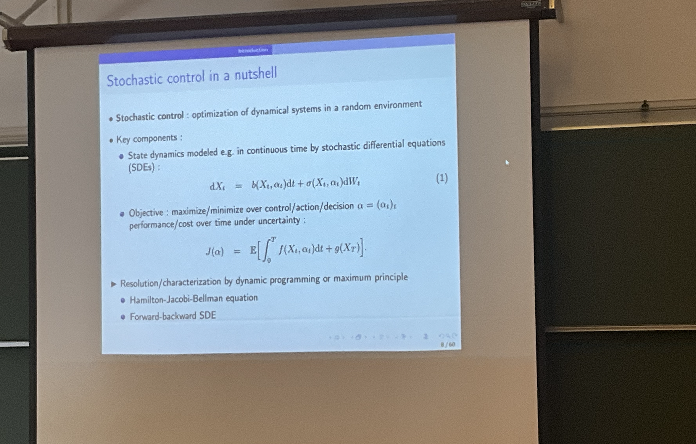
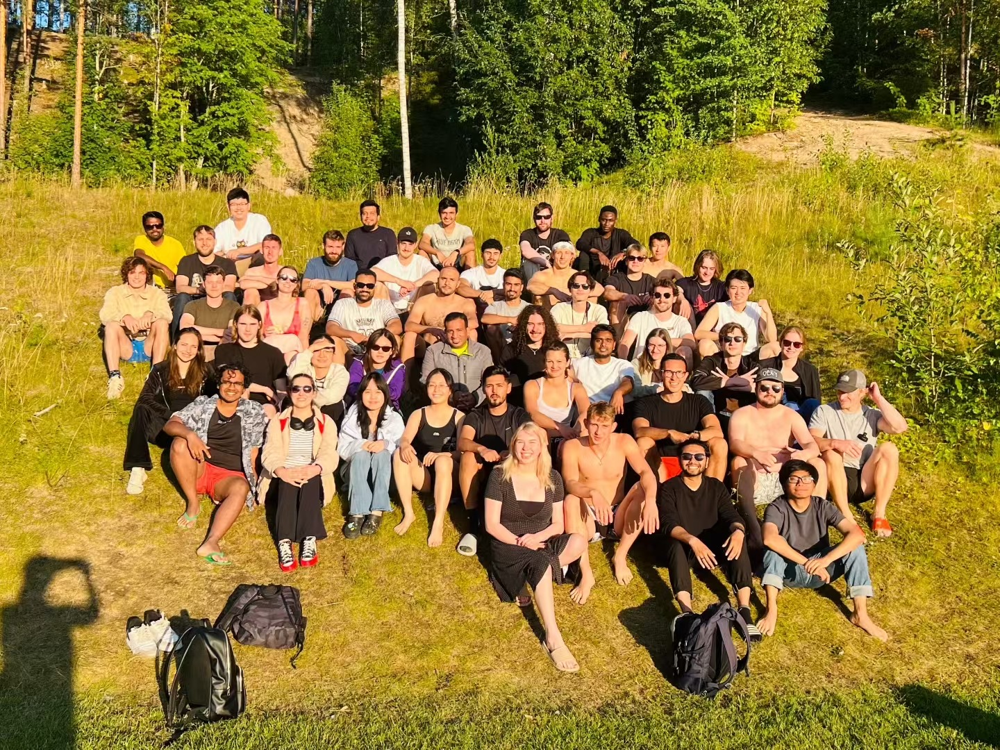

Two weeks at the summer school in Jyväskylä 🇫🇮 went by quickly.

### Week 1: Machine Learning & Stochastic Control  
I took a course with **Prof. Huyên PHAM** on machine learning and stochastic control.  
The lectures covered:  
- Bellman equations and value functions  
- Reinforcement learning in both discrete (MDP) and continuous-time settings  
- Deep learning methods for solving PDEs/BSDEs  

This experience deepened my interest in the applications of machine learning.

[There is my lecture notes](ML&SC.pdf)

[There is the lecture slides](https://users.jyu.fi/~geiss/workshops/ma1-2025/ma1.html)

### Week 2: Interactive Multi-Objective Optimization  
I then joined a course taught by the **Optimization Group at JYU**, focusing on:  
- Scalarization-based methods  
- Evolutionary approaches for exploring Pareto fronts  
- Hands-on practice with the **DESDEO framework** for modeling decision-making problems  

This was challenging but very rewarding, giving me practical exposure to interactive optimization methods.  

[There is the lecture slides](/Op/)

### Beyond the Classroom  
Outside of class, I:  
- Experienced the traditional **Finnish sauna**  
- Enjoyed a **lake-side BBQ**  
- Explored the beautiful surroundings by **cycling**  

Most importantly, I met many new friends from around the world. Thanks to Mea, the social activity organizer, these two weeks were both academically and personally unforgettable.  

---

